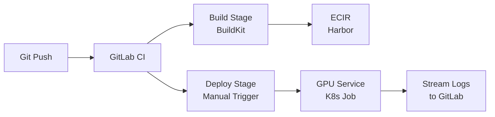

# CI/CD Job Submission with GitLab and ECIR

## Requirements

It is recommended that users complete [Getting started with Kubernetes](./L1_getting_started.md), [Requesting persistent volumes](./L2_requesting_persistent_volumes.md), and [Running a PyTorch Pod](./L3_running_a_pytorch_task.md) before proceeding with this tutorial.

You will also need:

- An [EIDF GitLab](../../gitlab/index.md) project with CI/CD enabled
- An [ECIR](../../registry/index.md) project for container images
- Access to the [GPU Service](../index.md) with a Kueue queue
- A [CephFS PVC](../shared-cephfs.md) or [dynamic PVC](./L2_requesting_persistent_volumes.md) for data storage

## Overview

The [Template K8s Workflow](./L4_template_workflow.md) tutorial shows how to build Docker images manually or with GitHub Actions and push to DockerHub. This tutorial presents an alternative that uses **EIDF-native services throughout**:

- **EIDF GitLab** for code hosting and CI/CD pipelines
- **ECIR (Harbor)** for container image storage
- **GPU Service** for running Kubernetes Jobs

The result is a two-stage GitLab CI/CD pipeline that:

1. **Builds** a Docker image and pushes it to ECIR
2. **Deploys** Kubernetes Jobs to the GPU Service (manually triggered per experiment)

Each deploy job submits the K8s Job, streams Pod logs back to GitLab, and reports success or failure — replacing manual `kubectl create` and `kubectl logs` commands.



!!! note "This is one approach, not the only way"
    This tutorial documents one working pattern based on a real EIDF project. It is intended as a skeleton that should be adapted for  your own needs.

## Project structure

A typical project using this pattern has the following layout:

```
my-project/
├── Dockerfile                          # Packages code + dependencies
├── requirements.txt                    # Python dependencies
├── .gitlab-ci.yml                      # CI/CD pipeline definition
├── train_script.py                     # Your training / compute code
├── job_scripts/
│   ├── experiment-a/
│   │   ├── job.yaml                    # K8s Job manifest
│   │   └── run.sh                      # Entrypoint shell script
│   └── experiment-b/
│       ├── job.yaml
│       └── run.sh
```

## Step 1: Create a Dockerfile

Package your code and dependencies into a Docker image. The key convention is to install dependencies at **build time** so that no runtime `pip install` is needed.

```dockerfile
# Choose a base image that matches your runtime needs
FROM pytorch/pytorch:2.5.1-cuda12.4-cudnn9-devel

WORKDIR /app

# Install dependencies at build time
COPY requirements.txt .
RUN pip install --no-cache-dir -r requirements.txt

# Copy training code
COPY train_script.py .

# Copy job shell scripts (preserving directory structure)
COPY job_scripts/ job_scripts/

# Make all shell scripts executable
RUN find job_scripts/ -name "*.sh" -exec chmod +x {} \;

# Default entrypoint — overridden by K8s Job command/args
CMD ["/bin/bash"]
```

!!! tip "Keep images small"
    Only `COPY` the files needed for the job. Avoid copying data files, notebooks, or `.git/` into the image — data should live on a PVC.

## Step 2: Create job shell scripts

Each experiment gets a simple entrypoint shell script, baked into the image, that runs the Python command with the right arguments.

```bash
#!/bin/bash
# Code is baked into the Docker image at /app — no pip install needed.
# Data is read from and output written to the PVC mount.
cd /app
python3 train_script.py --work_dir /mnt/ceph/my-project/experiment-a/
```

Place scripts under `job_scripts/<experiment-name>/run.sh`. Keep them simple — they should just `cd /app` and run the command.

## Step 3: Create Kubernetes Job YAMLs

Each experiment gets a K8s Job manifest. These manifests contain `${VARIABLE}` placeholders that are substituted by the CI pipeline at deploy time using `envsubst`.

```yaml
apiVersion: batch/v1
kind: Job
metadata:
  generateName: my-experiment-a-job-
  labels:
    kueue.x-k8s.io/queue-name: <project-namespace>-user-queue
spec:
  completions: 1
  backoffLimit: 1
  ttlSecondsAfterFinished: 1800
  activeDeadlineSeconds: 14400  # 4 hour hard limit
  template:
    metadata:
      name: my-experiment-pod
    spec:
      restartPolicy: Never
      containers:
        - name: my-experiment-pod
          # These variables are substituted by envsubst in the CI pipeline
          image: ${HARBOR_HOST}/${HARBOR_PROJECT}/my-image:latest
          command:
            - "/bin/bash"
            - "-c"
            - "--"
          args:
            - >
              /app/job_scripts/experiment-a/run.sh;
          resources:
            requests:
              cpu: 16
              memory: "8Gi"
            limits:
              cpu: 16
              memory: "8Gi"
              nvidia.com/gpu: 1
          volumeMounts:
            - mountPath: /mnt/ceph
              name: volume
            - mountPath: /dev/shm
              name: dshm
      imagePullSecrets:
        - name: ${IMAGE_PULL_SECRET}
      volumes:
        - name: dshm
          emptyDir:
            medium: Memory
        - name: volume
          persistentVolumeClaim:
            claimName: my-project-pvc
      nodeSelector:
        nvidia.com/gpu.product: NVIDIA-A100-SXM4-40GB-MIG-1g.5gb
```

Things to note:

- **`${HARBOR_HOST}/${HARBOR_PROJECT}/...`** — substituted by `envsubst` from CI variables
- **`${IMAGE_PULL_SECRET}`** — references the K8s secret for pulling from ECIR (see [ECIR K8s access](../../registry/working-with.md#kubernetesgpu-service-access))


## Step 4: Create the `.gitlab-ci.yml`

This is the core of the pipeline. It has two stages: **build** (automatic) and **deploy** (manual).

```yaml
# =============================================================================
# GitLab CI/CD Pipeline — K8s Job Submission via ECIR
#
# Required CI/CD Variables (set in GitLab → Settings → CI/CD → Variables):
#   KUBECONFIG_B64        Base64-encoded kubeconfig for the GPU cluster
#   K8S_NAMESPACE         Kubernetes namespace to submit Jobs into
#   IMAGE_PULL_SECRET     Name of the imagePullSecret in the K8s namespace

# Variables automatically set by GitLab's [Harbor Integration](https://docs.gitlab.com/ee/user/project/clusters/kubernetes/harbor_integration.html)
#   HARBOR_HOST           Harbor host URL
#   HARBOR_USERNAME       Harbor username
#   HARBOR_PASSWORD       Harbor password
#   HARBOR_PROJECT        Harbor project name
# =============================================================================

stages:
  - build
  - deploy

# Shared setup: write kubeconfig from CI variable
.kubeconfig_setup: &kubeconfig_setup |
  mkdir -p ~/.kube
  echo "${KUBECONFIG_B64}" | base64 -d > ~/.kube/config
  chmod 600 ~/.kube/config

# ---------------------------------------------------------------------------
# Stage 1: Build & push Docker image to ECIR
# ---------------------------------------------------------------------------

build-image:
  image: moby/buildkit:rootless
  stage: build
  variables:
    DOCKER_AUTH_CONFIG: '{"auths":{"$HARBOR_HOST":{"username":"$HARBOR_USERNAME","password":"$HARBOR_PASSWORD"}}}'
    BUILDKITD_FLAGS: --oci-worker-no-process-sandbox
  before_script:
    - mkdir -p ~/.docker
    - echo "${DOCKER_AUTH_CONFIG}" > ~/.docker/config.json
  script:
    - |
      buildctl-daemonless.sh build \
        --frontend=dockerfile.v0 \
        --local context=. \
        --local dockerfile=. \
        --output type=image,name=${HARBOR_HOST}/${HARBOR_PROJECT}/my-image:latest,push=true
  rules:
    - if: '$CI_PIPELINE_SOURCE == "push"'
    - if: '$CI_PIPELINE_SOURCE == "web"'

# ---------------------------------------------------------------------------
# Stage 2: Deploy K8s Jobs (manual trigger)
# ---------------------------------------------------------------------------

.deploy_job_template: &deploy_job_template
  stage: deploy
  when: manual
  image: ${HARBOR_HOST}/docker-cache/alpine/kubectl:latest
  timeout: 6 hours
  before_script:
    - apk add envsubst
    - *kubeconfig_setup
    - mkdir -p ~/.docker
    - echo "${DOCKER_AUTH_CONFIG}" > ~/.docker/config.json
  script:
    - |
      echo "=== Submitting Job: ${JOB_YAML_PATH} ==="

      # Substitute CI variables into the Job YAML
      envsubst < ${JOB_YAML_PATH} > /tmp/job.yaml
      cat /tmp/job.yaml

      # Create the Job (not 'apply' — generateName requires 'create')
      JOB_OUTPUT=$(kubectl create -f /tmp/job.yaml -n ${K8S_NAMESPACE})
      echo "${JOB_OUTPUT}"

      # Extract the Job name from kubectl output
      JOB_NAME=$(echo "${JOB_OUTPUT}" | grep -oE '[a-z0-9]+-job-[[:alnum:]_-]+')
      echo "${JOB_NAME}" > /tmp/job_name.txt
      echo "=== Created K8s Job: ${JOB_NAME} ==="

      # Wait for Pod to start
      kubectl wait --for=condition=ready pod \
        -l job-name=${JOB_NAME} \
        -n ${K8S_NAMESPACE} \
        --timeout=300s || true

      # Get Pod name and stream logs
      POD_NAME=$(kubectl get pods -n ${K8S_NAMESPACE} \
        -l job-name=${JOB_NAME} \
        --sort-by=.metadata.creationTimestamp \
        -o jsonpath='{.items[-1].metadata.name}')
      echo "=== Streaming logs from Pod: ${POD_NAME} ==="
      kubectl logs -f ${POD_NAME} -n ${K8S_NAMESPACE} || true

      # Check final status
      kubectl wait --for=condition=complete \
        job/${JOB_NAME} \
        -n ${K8S_NAMESPACE} \
        --timeout=10s

      if [ $? -eq 0 ]; then
        echo "=== Job ${JOB_NAME} completed successfully ==="
        exit 0
      else
        FAILED=$(kubectl get job/${JOB_NAME} -n ${K8S_NAMESPACE} \
          -o jsonpath='{.status.failed}')
        echo "=== Job ${JOB_NAME} failed (failed pods: ${FAILED}) ==="
        exit 1
      fi
  after_script:
    - *kubeconfig_setup
    - |
      if [ "$CI_JOB_STATUS" == "canceled" ] && [ -f /tmp/job_name.txt ]; then
        JOB_NAME=$(cat /tmp/job_name.txt)
        echo "=== Pipeline cancelled! Cleaning up K8s Job: ${JOB_NAME} ==="
        kubectl delete job/${JOB_NAME} -n ${K8S_NAMESPACE} --ignore-not-found
      fi

# Add one block per experiment, overriding JOB_YAML_PATH:
submit:experiment-a:
  <<: *deploy_job_template
  variables:
    JOB_YAML_PATH: job_scripts/experiment-a/job.yaml
    DOCKER_AUTH_CONFIG: '{"auths":{"$HARBOR_HOST":{"username":"$HARBOR_USERNAME","password":"$HARBOR_PASSWORD"}}}'
  needs:
    - build-image
```

### How it works

1. **On every push**, the `build-image` job uses [BuildKit](https://github.com/moby/buildkit) to build the Dockerfile and push the image to ECIR
2. **Deploy jobs are manually triggered** from the GitLab pipeline UI — click the play button next to the experiment you want to run
3. The deploy job uses `envsubst` to inject CI variables (like the ECIR image URL) into the K8s Job YAML, then submits it with `kubectl create`
4. It waits for the Pod to start, streams logs back to the GitLab job output, and exits non-zero if the Job failed

## Step 5: Configure GitLab CI/CD variables

In your GitLab project, go to **Settings → CI/CD → Variables** and add:

| Variable | Value | Masked | Protected |
|----------|-------|--------|-----------|
| `KUBECONFIG_B64` | Your kubeconfig, base64-encoded: `cat ~/.kube/config \| base64` | Yes | Yes |
| `K8S_NAMESPACE` | Your project namespace (e.g. `eidf042ns`) | No | Optional |
| `IMAGE_PULL_SECRET` | Name of the imagePullSecret in your namespace | No | Optional |

!!! tip "Harbor variables are automatic"
    If your GitLab project has the Harbor integration enabled, the variables `HARBOR_HOST`, `HARBOR_USERNAME`, `HARBOR_PASSWORD`, and `HARBOR_PROJECT` are injected automatically — you do not need to set them manually.

The `IMAGE_PULL_SECRET` references a K8s secret in your namespace that allows the GPU Service to pull images from your private ECIR project. See [ECIR Kubernetes Access](../../registry/working-with.md#kubernetesgpu-service-access) for how to create this secret.

## Step 6: Run a pipeline

1. Push your code to the GitLab repository
2. Go to **Build → Pipelines** in GitLab — the `build-image` job runs automatically
3. Once the build completes, click the **play button** (▶) next to the deploy job you want to run
4. The deploy job streams Pod logs directly in the GitLab job output — no need to SSH in and run `kubectl logs`
5. The pipeline reports success (green) or failure (red) based on the K8s Job exit code

To add more experiments, duplicate the `submit:experiment-a` block in `.gitlab-ci.yml`, change the `JOB_YAML_PATH`, and create the corresponding `job_scripts/<name>/` directory with its Job YAML and shell script.

## Tips and common gotchas

!!! warning "`kubectl create` not `kubectl apply`"
    Because the Job YAML uses `generateName` (not `name`), you **must** use `kubectl create`. `kubectl apply` will fail with an error because there is no fixed name to apply to.

!!! warning "Missing `envsubst`"
    The `alpine/kubectl` image does not include `envsubst`. Install it in your `before_script` with `apk add envsubst`.

!!! warning "YAML anchor syntax"
    When defining a YAML anchor for a multi-line string, include the `|` block scalar indicator: `.kubeconfig_setup: &kubeconfig_setup |`. Missing the `|` causes parse errors.

!!! tip "`/dev/shm` for PyTorch"
    If your training script uses PyTorch DataLoader with `num_workers > 0`, you **must** mount `/dev/shm` as an `emptyDir` with `medium: Memory`. Without this, workers crash with a "bus error" because the default shared memory in containers is too small.

!!! tip "Docker auth in deploy jobs"
    The deploy runner needs registry credentials too (for `imagePullSecrets` to work). Write `~/.docker/config.json` in the deploy stage's `before_script`, not just the build stage.

## Next steps

This tutorial covers a minimal working pipeline. Consider extending it with:

- **Parameterised pipelines** — use GitLab CI `variables` with defaults so users can override hyperparameters from the pipeline UI
- **Automated tests** — add a `test` stage between `build` and `deploy` for a quick smoke test
- **Artifact collection** — copy results from the PVC back to GitLab artifacts after the Job completes
- **Notifications** — add Slack or email notifications on Job success or failure
- **GPU selection** — parameterise `nodeSelector` to target different GPU types per experiment
